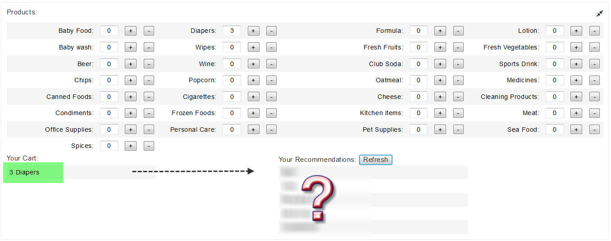
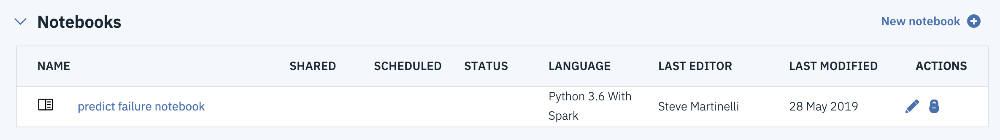
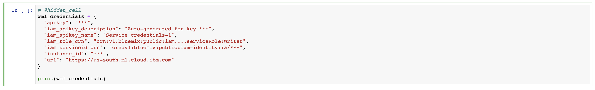
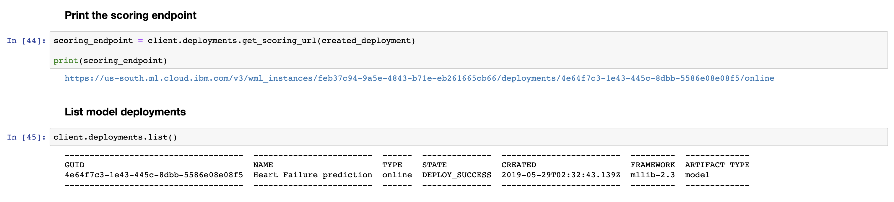

# Build a product recommendation engine with Watson Machine Learning and PixieApps

In this code pattern historical shopping data is used to build a recommendation engine with Spark and Watson Machine Learning. The model is then used in an interactive PixieApp in which a shopping basket is simulated and used to create a list of recommendations.

When you have completed this code patterns, you will understand how to:

* Use [Jupyter Notebooks](https://jupyter.org/) in [IBM Watson Studio](https://dataplatform.cloud.ibm.com/)
* Build a recommendation model with SparkML and Watson Machine Learning to provide product recommendations for customers based on their purchase history
* Build an interactive dashboard using [PixieApps](https://pixiedust.github.io/pixiedust/pixieapps.html)

The intended audience is data scientists and developers interested in building, deploying and testing machine learning models from a Jupyter notebook with Watson Machine Learning.

**Sample output**

Here's an example of what the final app looks like

## Flow

1. Load the provided notebook into Watson Studio
1. Load and transform the customer data in the notebook
1. Build a k-means clustering model with SparkML
1. Deploy the model to Watson Machine Learning
1. Test and compare the models build in the notebook and through the Watson Machine Learning API
1. Use the API to build an interactive PixieApp

## Included Components

* [IBM Watson Studio](https://cloud.ibm.com/catalog/services/watson-studio): a suite of tools and a collaborative environment for data scientists, developers and domain experts
* [IBM Apache Spark](https://cloud.ibm.com/catalog/services/apache-spark): an open source cluster computing framework optimized for extremely fast and large scale data processing
* [IBM Watson Machine Learning](https://cloud.ibm.com/catalog/services/machine-learning): a set of REST APIs to develop applications that make smarter decisions, solve tough problems, and improve user outcomes
* [Jupyter Notebooks](https://jupyter.org/): an open-source web application that allows you to create and share documents that contain live code, equations, visualizations and explanatory text
* [PixieDust](https://pixiedust.github.io/pixiedust/): Python helper library for Jupyter notebooks
* [PixieApps](https://pixiedust.github.io/pixiedust/pixieapps.html): Python library to write and run UI elements for analytics directly in a Jupyter notebook

## Steps

1. [Setup project and data in Watson Studio](#1-setup-project-and-data-in-watson-studio)
   * [Create a project in Watson Studio](#11-create-a-project-in-watson-studio)
   * [Provision a Watson Machine Learning service](#12-provision-a-watson-machine-learning-service)
   * [Create a notebook in Watson Studio](#13-create-a-notebook-in-watson-studio)
1. [Create and deploy a recommendation engine with Watson Studio](#2-create-and-deploy-a-recommendation-engine-with-watson-studio)
   * [Start stepping through the notebook](#21-start-stepping-through-the-notebook)
   * [Save the model](#22-save-the-model)
   * [Deploy the model](#23-deploy-the-model)
1. [Run the recommendation PixieApp](#3-run-the-recommendation-pixieapp)

### 1. Setup project and data in Watson Studio

To complete this code pattern we'll need to do a few setup steps before creating our model. In Watson Studio we need to: create a project, add our patient data (which our model will be based on), upload our notebook, and provision a Watson Machine Learning service.

#### 1.1. Create a project in Watson Studio

* Log into IBM's [Watson Studio](https://dataplatform.cloud.ibm.com). Once in, you'll land on the dashboard.

* Create a new project by clicking `+ New project` and choosing `Data Science`:

  

* Enter a name for the project name and click `Create`.

> **NOTE**: By creating a project in Watson Studio a free tier `Object Storage` service will be created in your IBM Cloud account. Select the `Free` storage type to avoid fees.

#### 1.2 Provision a Watson Machine Learning service

* Click on the navigation menu on the left (`☰`) to show additional options. Click on the `Watson Services` option.

   

* From the overview page, click `+ Add service` on the top right and choose the `Machine Learning` service. Select the `Lite` plan to avoid fees.

* Once provisioned, you should see the service listed in the `Watson Services` overview page. **Select the service by opening the link in a new tab.**  We're now in the IBM Cloud tool, where we will create service credentials for our now Watson Machine Learning service. Follow the numbered steps in the image below. **We'll be using these credentials in Step 2, so keep them handy!**.

   

* **TIP:** You can now go back the project via the navigation menu on the left (`☰`).

   

#### 1.3 Create a notebook in Watson Studio

The notebook we'll be using can be viewed in [`notebooks/wml-product-recommendation-engine.ipynb`](notebooks/wml-product-recommendation-engine.ipynb), and a completed version can be found in [`examples/wml-product-recommendation-engine-complete.ipynb`](examples/wml-product-recommendation-engine-complete.ipynb).

* From the new project `Overview` panel, click `+ Add to project` on the top right and choose the `Notebook` asset type. Fill in the following information:

  * Select the `From URL` tab. [1]
  * Enter a `Name` for the notebook and optionally a description. [2]
  * Under `Notebook URL` provide the following url: [https://github.com/IBM/product-recommendation-with-watson-ml/blob/master/notebooks/wml-product-recommendation-engine.ipynb](https://github.com/IBM/product-recommendation-with-watson-ml/blob/master/notebooks/wml-product-recommendation-engine.ipynb) [3]
  * For `Runtime` select the `Spark Python 3.6` option. [4]

  

* **TIP:** Once successfully imported, the notebook should appear in the `Notebooks` section of the `Assets` tab.

  

### 2. Create and deploy a predictive model with Watson Studio

Now that we're in our Notebook editor, we can start to create our predictive model by stepping through the notebook.

#### 2.1 Start stepping through the notebook

* Click the &#9654; `Run` button to start stepping through the notebook.

* In cell *2. Load and explore data* we call PixieDust's `display()` method to view the data interactively.

* Keep stepping through the code, pausing on each step to read the code and see the output for the opertion we're performing. At the end of *Step 3* we'll have used the [K-means Clustering](https://spark.apache.org/docs/latest/ml-clustering.html#k-means) algorithm on Spark ML to create a model. This model associates every customer to a cluster based on their shopping history.

#### 2.2 Save the model

The gist of the next two steps is to use the [Watson Machine Learning Python client](https://wml-api-pyclient.mybluemix.net/) to persist and deploy the model we just created.

* At the beginning of Step *5. Persist model*, before we deploy our model, we need up update the cell with credentials from our Watson Machine Learning service. (Remember that from [Step 1.2 Provision a Watson Machine Learning service](#12-provision-a-watson-machine-learning-service)?)

* Update the `wml_credentials` variable below. Copy and paste the entire credential dictionary, which can be found on the _Service Credentials_ tab of the Watson Machine Learning service instance created on the IBM Cloud.

   

* Keep stepping through the code, pausing on each step to read the code and see the output for the opertion we're performing. At the end of *Step 4* we'll have used the Watson Machine Learning service to persist and save our recommendation model! :tada:

#### 2.3 Deploy the model

* Now let's run *Step 5. Deploy model to the IBM cloud* of the notebook. Deploy our model so we can have an endpoint to score data against.

  

* In *Step 6. Create product recommendations* we create functions that query the database to find the most popular items for a cluster and calculate the recommendations based on a given cluster. This produces a list of recommended items based on the products and quantities in a user's cart, which uses Watson Machine Learning to calculate the cluster based on the shopping cart contents.

* Lastly, in *Step 6.1 Test product recommendations model*, these functions can now be used in a PixieApp to create an interactive dashboard.

## Example Output

Here we add some products to our cart, and get some recommendations:

## License

This code pattern is licensed under the Apache Software License, Version 2.  Separate third party code objects invoked within this code pattern are licensed by their respective providers pursuant to their own separate licenses. Contributions are subject to the [Developer Certificate of Origin, Version 1.1 (DCO)](https://developercertificate.org/) and the [Apache Software License, Version 2](https://www.apache.org/licenses/LICENSE-2.0.txt).

[Apache Software License (ASL) FAQ](https://www.apache.org/foundation/license-faq.html#WhatDoesItMEAN)
