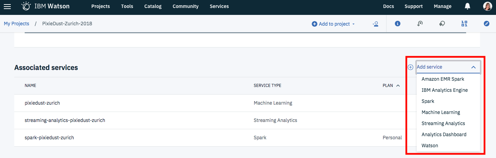
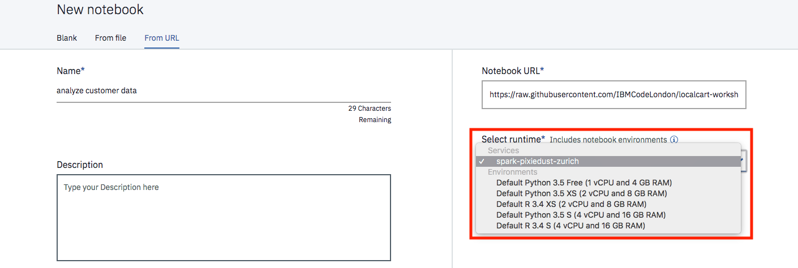
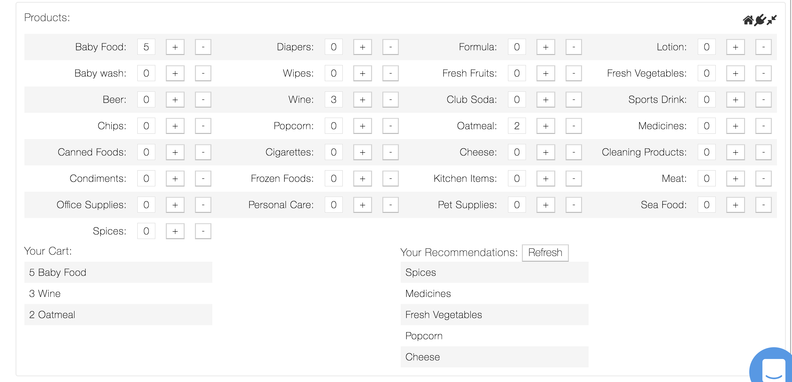

# Build a product recommendation engine with Watson Machine Learning and PixieApps

In this code pattern historical shopping data is used to build a recommendation engine with Spark and Watson Machine Learning. The model is then used in an interactive PixieApp in which a shopping basket is simulated and used to create a list of recommendations.

When you have completed this code patterns, you will understand how to:

* Use [Jupyter Notebooks](http://jupyter.org/) in [IBM Watson Studio](https://dataplatform.cloud.ibm.com/)
* Build a recommendation model with SparkML and Watson Machine Learning to provide product recommendations for customers based on their purchase history
* Build an interactive dashboard using [PixieApps](https://pixiedust.github.io/pixiedust/pixieapps.html)

The intended audience is data scientists and developers interested in building, deploying and testing machine learning models from a Jupyter notebook with Watson Machine Learning.

## Flow

1. Log in to IBM Watson Studio
1. Load the provided notebook into Watson Studio
1. Load and transform the customer data in the notebook
1. Build a k-means clustering model with SparkML
1. Deploy the model to Watson Machine Learning
1. Test and compare the models build in the notebook and through the Watson Machine Learning API
1. Use the API to build an interactive PixieApp

## Included Components

* [IBM Watson Studio](https://console.bluemix.net/catalog/services/watson-studio): a suite of tools and a collaborative environment for data scientists, developers and domain experts
* [IBM Apache Spark](https://console.ng.bluemix.net/catalog/services/apache-spark): an open source cluster computing framework optimized for extremely fast and large scale data processing
* [IBM Watson Machine Learning](https://console.bluemix.net/catalog/services/machine-learning): a set of REST APIs to develop applications that make smarter decisions, solve tough problems, and improve user outcomes

## Featured Technologies

* [Jupyter notebooks](http://jupyter.org/): an open-source web application that allows you to create and share documents that contain live code, equations, visualizations and explanatory text
* [PixieDust](https://pixiedust.github.io/pixiedust/): Python helper library for Jupyter notebooks
* [PixieApps](https://pixiedust.github.io/pixiedust/pixieapps.html): Python library to write and run UI elements for analytics directly in a Jupyter notebook

<!--
# Watch the video
-->

# Steps

Follow these steps to setup and run this code pattern. The steps are described in detail below.

1. [Sign up for Watson Studio](#1-sign-up-for-watson-studio)
1. [Create a project and add services](#2-create-a-project-and-add-services)
1. [Create a notebook](#3-create-the-notebook)
1. [Load customer data in the notebook](#4-load-customer-data)
1. [Add a Watson Machine Learning service](#5-add-watson-machine-learning)
1. [Build and run the recommendation PixieApp](#6-build-the-pixieapp)

## 1. Sign up for Watson Studio

Sign up for [IBM Watson Studio](https://dataplatform.ibm.com). By creating a project in Watson Studio a free tier ``Object Storage`` service will be created in your IBM Cloud account.

## 2. Create a project and add services

* In Watson Studio create a new project which will contain the notebook and connections to the IBM Cloud services. Choose the `Data Science` project tile.
* Associate the project with an Apache Spark service instance. Go to `Settings` tab in the new Project and scroll down to `Associated Services`. Click `+` and select `Spark` from the drop-down menu. Select an existing service or create a new one for free.

> Note: This notebook will work with Python 3.x. You cannot use Python 2.x

* Also add Watson Machine Learning to the project from the same drop-down menu. Click `+` and select `Watson` from the drop-down menu. Select an existing `Watson Machine Learning` service or create a new one for free.

 

## 3. Create a notebook

* In the `Assets` tab of the new project, select `Notebooks` -> `+ New notebook` OR select `+ Add to project` -> `Notebook`.
* Select the `From URL` tab.
* Enter a name for the notebook.
* Optionally, enter a description for the notebook.
* Enter this Notebook URL: https://raw.githubusercontent.com/IBM/product-recommendation-with-watson-ml/master/notebooks/wml-product-recommendation-engine.ipynb
* Make sure you select the Spark service you associated with the project as your runtime.
* Click the `Create` button.

## 4. Load customer data in the notebook

* Run the cells one at a time. Select the cell, and then press the &#9654;`Run` button in the toolbar.
* You will load the data into the notebook in cell `1.1. Load sample data` and view it when running PixieDust `display()` in cell `1.3 View data in a table by using Pixiedust`.
* Prepare the data and create a k-means model with [Spark ML](http://spark.apache.org/docs/2.0.0/api/python/pyspark.ml.html) by running the cells under `2. Create a k-means model`. This model associates every customer to a cluster based on their shopping history.

## 5. Add the Watson Machine Learning credentials to the notebook

To access the machine learning service programmatically, you need to copy in your credentials, which you can find in your IBM Watson Machine Learning service details in IBM Cloud.

* Open your [IBM Cloud Data Services list](https://apsportal.ibm.com/settings/services?context=analytics). A list of your provisioned services is displayed.
* Locate your **IBM Watson Machine Learning** service and click on the service instance name.
* Open the `Service Credentials` tab and view the credentials.
* Copy your credentials and replace the `**URL**`, `**USERNAME**`, `**PASSWORD**` and `**INSTANCE_ID**` placeholders in the notebook and run the cell.

## 6. Deploy the model to the Cloud and run the product recommendation PixieApp

The last part of the notebook will walk you through the following steps:

* Section `4. Deploy model to the cloud` by using the [Watson Machine Learning Python client library](http://wml-api-pyclient.mybluemix.net/) and test the deployment of the model.
* Section `5. Create product recommendations` with functions that query the database to find the most popular items for a cluster and calculate the recommendations based on a given cluster. This produces a list of recommended items based on the products and quantities in a user's cart, which uses Watson Machine Learning to calculate the cluster based on the shopping cart contents.
* Section `5.1 Test product recommendations model`. These functions can now be used in a PixieApp to create an interactive dashboard.

# Example Output

Here we add some products to our cart, and get some recommendations:

# Related links

[Build a recommender with Apache Spark and Elasticsearch](https://developer.ibm.com/code/patterns/build-a-recommender-with-apache-spark-and-elasticsearch/)

[Create a web-based mobile health app using Watson services on IBM Cloud and IBM Watson Studio](https://developer.ibm.com/code/patterns/develop-web-based-mobile-health-app-uses-machine-learning/)

[Use machine learning to predict U.S. opioid prescribers with Watson Studio and scikit-learn](https://developer.ibm.com/code/patterns/analyze-open-medical-data-sets-to-gain-insights/)

# License

[Apache 2.0](LICENSE)
